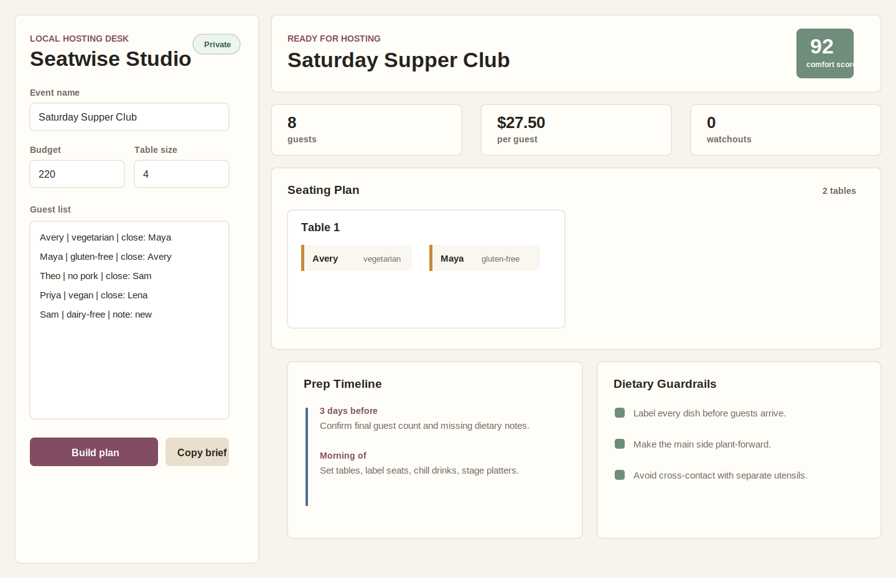

# Seatwise Studio

Seatwise Studio is a private desktop planner for dinner parties, supper clubs, and small home gatherings. Add guests, dietary needs, friendly pairs, requested separations, and host notes; the app builds a seating plan, prep timeline, budget split, menu guardrails, and conversation prompts.

Everything runs locally on your computer. No account, cloud sync, telemetry, or API key is required.



## Features

- Desktop app built with Electron.
- Guest parser for names, dietary needs, close pairs, requested distance, and useful notes.
- Seating recommender that balances friendly anchors, separation requests, table size, and dietary complexity.
- Host planning workflow for seating, prep timing, budget, menu safety, and table conversation prompts.
- Copy-ready Markdown brief for notes, messages, or printing.
- Seeded demo event so the full workflow is visible on first launch.
- Works offline and keeps event details on your machine.

## Installation

Requirements:

- Node.js 20 or newer
- npm

```bash
git clone https://github.com/iwaheedsattar/seatwise-studio.git
cd seatwise-studio
npm install
npm start
```

## Usage

1. Enter the event name, date, budget, and table size.
2. Paste guest rows using this format:

```text
Name | dietary need | close: Friend A, Friend B | avoid: Guest C | note: useful context
```

3. Review the generated seating cards, dietary guardrails, budget split, prep timeline, and table prompts.
4. Press **Copy brief** to copy a Markdown hosting plan.

Example guest row:

```text
Avery | vegetarian | close: Maya, Theo | avoid: Jordan | note: loves board games
```

## Development

```bash
npm install
npm test
npm run smoke
npm start
```

The planning engine lives in `src/planner.js` and is covered by Node's built-in test runner.

## Roadmap

- Save and reopen multiple events.
- Drag-and-drop seat swaps with live comfort scoring.
- Printable place cards and prep checklists.
- Import contacts from CSV.
- Optional local menu templates for brunch, potluck, and cocktail formats.

## Privacy

Seatwise Studio does not send guest lists, dietary notes, or event details to a server. The current version stores no account data and runs the planning workflow locally.
